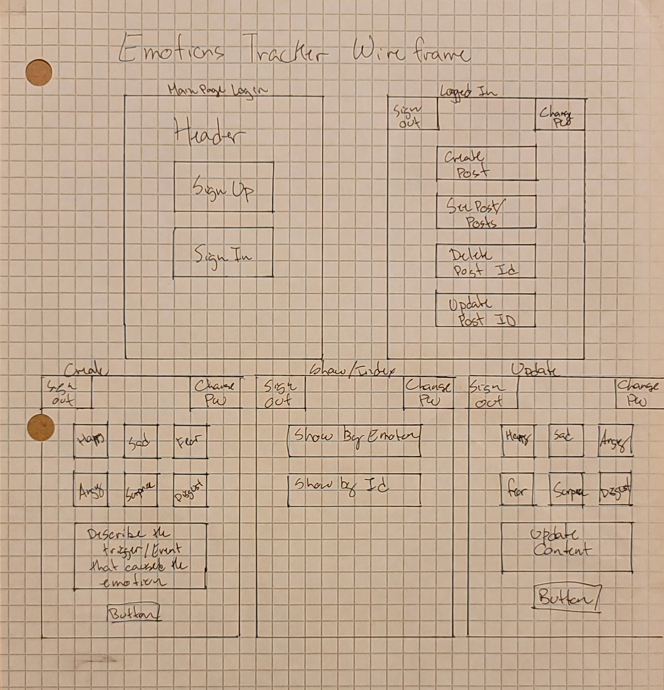

# Emotion Tracker: Feel your feels

My project idea is to build an emotion tracker app. Growing up, my generation was taught to hide and shy away from our emotions. That emotion and expression were bad. It was more important that we fit in with gender and age stereotypes than expressing what we really felt. I want children, specifically, to feel their emotions and understand that all emotions are to be heard and that they don't make us weak but empower us. Target audience would be 4 years and older. If we can normalize feelings and expressions at a younger age, the next generation can grow to be much healthier and more intune with themselves.

## Important links
- [deployed link](https://miketocoding.github.io/emotion-tracker-client/)
- [API Repo Link](https://github.com/miketocoding/emotion-tracker)
- [API Herokuapp Link](https://fathomless-lowlands-47912.herokuapp.com)
- [Client Repo Link](https://github.com/miketocoding/emotion-tracker-client)

## Planning

### User stories

- As a user, I want to sign in/up/out so I can access my data but no one else can.
- As a user, I want to Create new posts
- As a user, I want to Read multiple/single posts
- As a user, I want to Update a post I make
- As a user, I want to Delete posts I've made
- As a user, I want to see anonymous posts others have made

## Images

### Wireframe:

